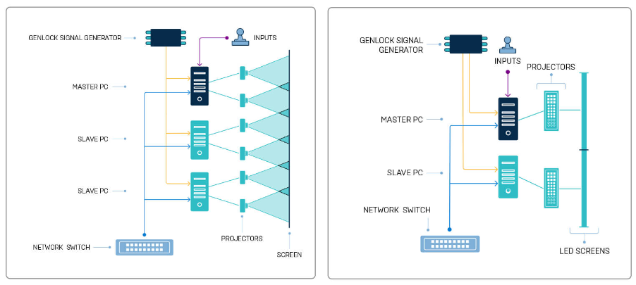

# Unreal Engine nDisplay

## 1. 개요

### 언리얼 엔진의 nDisplay란?

언리얼 엔진의 nDisplay는 여러 디스플레이 디바이스를 하나의 통합된 화면으로 만들어주는 기술입니다. 주로 대형 스크린, 몰입형 환경, VR, AR, 시뮬레이션에서 사용됩니다.

이러한 시스템은 Powerwall(https://en.wikipedia.org/wiki/Powerwall) 디스플레이처럼 여러 개의 화면을 붙인 것일 수도 있고, Cave(https://en.wikipedia.org/wiki/Cave_automatic_virtual_environment) 가상 환경처럼 여러 대의 프로젝터로 돔, 벽 타일, 굽은 화면과 같은 물리 표면에 3D 환경을 만든 것일 수도 있습니다.

<table class="center">
<td style="border-collapse:collapse;">
    
</td>
<td style="border-collapse:collapse;">
    
</td>
<td style="border-collapse:collapse;">
    
</td>
</table>

## 2. 특징 및 장 · 단점

### 특징

- 멀티 디스플레이 설정
  - 여러 디스플레이를 사용하여 하나의 통합된 화면을 구성할 수 있습니다.
  - 디스플레이 벽, 돔 프로젝션, 파노라마 스크린 등 다양한 형태의 디스플레이 설정을 지원합니다
- 동기화
  - 클러스터의 모든 디스플레이 노드에서 프레임, 입력, 이벤트를 동기화하여 일관된 시각적 경험을 제공합니다.
  - 네트워크를 통해 여러 컴퓨터 간의 동기화를 관리합니다.
- 클러스터 관리
  - 여러 컴퓨터를 클러스터로 구성하여 각각의 노드가 디스플레이를 제어할 수 있습니다.
  - 마스터 노드와 슬레이브 노드로 구성되며, 마스터 노드가 전체 클러스터를 제어합니다.
- VR 및 AR 지원
  - 가상 제작(Virtual Production), 시뮬레이션, 교육, 전시, 테마파크 등 다양한 분야에서 활용됩니다.
  - VR 및 AR 환경에서 몰입형 경험을 제공합니다.
- 확장성
  - 시스템을 쉽게 확장하여 추가 디스플레이와 컴퓨터를 통합할 수 있습니다.
  - 다양한 해상도와 디스플레이 형태를 지원하여 유연한 구성이 가능합니다.

### 장점

- 높은 확장성
  - 디스플레이와 컴퓨터를 추가하여 시스템을 확장할 수 있어 대형 몰입형 환경을 구축할 수 있습니다.
- 다양한 디스플레이 환경 지원
  - 다양한 형태와 해상도의 디스플레이를 지원하여 여러 가지 시각적 경험을 제공할 수 있습니다.
- 실시간 동기화 및 렌더링
  - 여러 디스플레이 간의 동기화를 통해 일관된 시각적 경험을 제공하며, 실시간으로 콘텐츠를 렌더링할 수 있습니다.
- 몰입형 경험 제공
  - 몰입형 시뮬레이션, 가상 제작, 시뮬레이션, 교육 등 다양한 분야에서 몰입형 경험을 제공하여 사용자 참여도를 높일 수 있습니다.

### 단점

- 설정의 복잡성
  - 초기 설정이 복잡할 수 있으며, 설정 파일 작성과 시스템 구성이 어려울 수 있습니다.
  - 각 노드와 디스플레이 간의 동기화를 맞추는 데 시간과 노력이 필요합니다.
- 높은 초기 구축 비용
  - 하드웨어와 소프트웨어 구축 비용이 높을 수 있습니다.
  - 고성능 컴퓨터와 디스플레이 장비가 필요합니다.
- 하드웨어 요구 사항
  - 높은 성능의 하드웨어가 필요하며, 네트워크 인프라도 안정적이어야 합니다.
  - 각 노드가 원활하게 작동하기 위해 충분한 리소스를 갖추어야 합니다.
- 네트워크 지연 문제
  - 네트워크 지연으로 인해 동기화 문제가 발생할 수 있습니다.
  - 네트워크 성능이 중요한 역할을 하며, 지연을 최소화하기 위한 추가 설정이 필요합니다.
  - 운전 시뮬레이션에는 적합하지 않을 수 있습니다.

## 3. 활용 사례

- 가상 제작 (Virtual Production): 영화 및 TV 제작에서 LED 벽 사용.
  - LED 벽을 구축하고, 실시간으로 배경을 렌더링하여 배우가 그 앞에서 연기할 수 있게 합니다. 이는 촬영 환경을 실시간으로 변경할 수 있어 시간과 비용을 절약할 수 있습니다.
  - 디즈니의 "The Mandalorian" 시리즈에서 LED 벽을 사용하여 다양한 환경을 실시간으로 생성하고 촬영했습니다.
- 시뮬레이션 및 교육(Simulation and Training): 훈련 시뮬레이터.
  - 군사, 항공, 해양 등 다양한 분야에서 시뮬레이션 훈련에 사용됩니다. 여러 디스플레이를 사용하여 몰입형 환경을 제공함으로써 훈련 효과를 극대화할 수 있습니다.
  - 비행 시뮬레이터에서 조종사가 실제와 같은 환경에서 훈련할 수 있도록 여러 화면을 통해 360도 시야를 제공합니다.
- 몰입형 전시 및 테마파크(Immersive Exhibits and Theme Parks): 대형 몰입형 디스플레이 설치.
  - 테마파크에서 nDisplay를 사용하여 대형 몰입형 디스플레이를 설치하여 방문객에게 몰입형 경험을 제공합니다. 이는 스토리텔링을 강화하고 방문객의 참여도를 높입니다.
  - 유니버설 스튜디오의 어트랙션에서 대형 스크린을 통해 방문객이 다양한 가상 세계를 체험할 수 있게 합니다.
- VR 및 AR 환경(VR and AR Environments): 몰입형 가상 현실 체험 공간.
  - 가상 현실(VR)과 증강 현실(AR) 환경에서 여러 디스플레이를 사용하여 몰입형 경험을 제공합니다. 이는 교육, 엔터테인먼트, 의료 등 다양한 분야에서 활용됩니다.
  - 의료 교육에서 가상 해부학 실습을 제공하여 학생들이 보다 직관적으로 학습할 수 있도록 합니다.
- 전시 및 이벤트 (Exhibitions and Events): 대형 전시회 및 이벤트
  - 대형 전시회나 이벤트에서 nDisplay를 사용하여 다양한 정보를 시각적으로 전달할 수 있습니다. 이는 관객의 관심을 끌고, 더 효과적으로 메시지를 전달하는 데 도움을 줍니다.
  - CES와 같은 대형 전시회에서 기술 회사들이 nDisplay를 사용하여 신제품을 시각적으로 효과적으로 홍보합니다.
- 건축 시각화: 건축 프로젝트 시각화
  - 건축 프로젝트의 시각화를 실시간으로 제공함으로써, 설계자와 고객이 건축물의 다양한 측면을 실제와 같은 환경에서 검토할 수 있습니다
  - 건축 디자인 프레젠테이션에서 여러 디스플레이를 통해 건물의 내부와 외부를 다양한 각도에서 실시간으로 보여줍니다.

## 4. 설정 및 구성

- 설정 파일 작성: nDisplay 설정 파일은 클러스터 구성, 뷰포트 설정, 동기화 옵션 등을 정의.
- 클러스터 구성: 여러 컴퓨터를 클러스터로 묶어 디스플레이를 관리.
- 동기화 설정: 프레임, 입력, 이벤트 동기화 설정 방법.
- 디버깅 방법: nDisplay 시스템의 문제 해결 및 디버깅 방법.
- https://www.notion.so/Unreal-nDisplay-ce45fec496ea461e81d8dc1accf0f7c0

<table class="center">
<td>
    
</td>
</table>

## 5. 결론

언리얼 nDisplay는 다양한 산업 분야에서 대규모 디스플레이 시스템을 구축하고, 몰입형 경험을 제공하는 데 매우 유용한 도구입니다. 이를 통해 사용자들은 더욱 생생하고 실감 나는 시각적 경험을 즐길 수 있습니다. 높은 확장성과 유연한 구성 옵션을 제공하지만, 초기 설정의 복잡성과 높은 구축 비용, 하드웨어 요구 사항 등을 고려해야 합니다. 이를 통해 가상 제작, 시뮬레이션, 교육 등 다양한 분야에서 효과적으로 활용할 수 있습니다.

## 관련 기사 및 동영상

- [Unreal nDisplay](https://dev.epicgames.com/documentation/ko-kr/unreal-engine/ndisplay-overview-for-unreal-engine?application_version=5.3)

- [Unreal nDisplay Technology](https://cdn2.unrealengine.com/Unreal+Engine%2Fndisplay-whitepaper-final-updates%2FnDisplay_Whitepaper_FINAL-f87f7ae569861e42d965e4bffd1ee412ab49b238.pdf)

- [Unreal nDisplay Rendering](https://www.youtube.com/watch?v=XdxJ3Kl7PqQ)

- [리얼타임 콘텐츠의 무한한 확장을 살펴보세요](https://www.unrealengine.com/ko/tech-blog/explore-ndisplay-technology-limitless-scaling-of-real-time-content)

- [실시간 애니메이션으로 팬을 매료시킨 Childish Gambino](https://www.unrealengine.com/ko/spotlights/childish-gambino-mesmerizes-fans-with-real-time-animation)

- [Disguise 클러스터 렌더링](https://www.disguise.one/media/7383/disguise_xr_ndisplay_ebook_korean.pdf)

- [실감미디어 제작을 위한 XR 시스템 구성,
  특징 및 활용 동향](https://www.kca.kr/Media_Issue_Trend/vol52/sub02_01.html)

- [다중화면 몰입형 VR 시연 - 클리닝 히터룸 VR](https://www.youtube.com/watch?v=iARhcsI0qxc)

- [만달로리안은 어떻게 만들어졌나?](https://www.ut-hub.com/tecnologia-ndisplay-the-mandalorian)

- [영화 제작자들에게 새로운 제작 파이프라인을 선사한 'The Mandalorian'](https://www.unrealengine.com/ko/blog/forging-new-paths-for-filmmakers-on-the-mandalorian)

- [영화 제작에서의 nDisplay](https://beforesandafters.com/2019/08/05/i-think-ive-seen-a-glimpse-into-the-future-of-filmmaking)

- [PXO에서 ‘Star Trek: Discovery’를 위해 실사 ‘Holodeck’을 제작한 이유](https://www.unrealengine.com/ko/spotlights/why-pxo-created-a-real-life-holodeck-for-star-trek-discovery)

- [언리얼 엔진 기반의 버추얼 프로덕션으로 Amazon의 Fallout 시리즈에 생명을 불어넣은 Magnopus](https://www.unrealengine.com/ko/spotlights/magnopus-brings-amazon-s-fallout-series-to-life-with-virtual-production-powered-by-unreal-engine)
